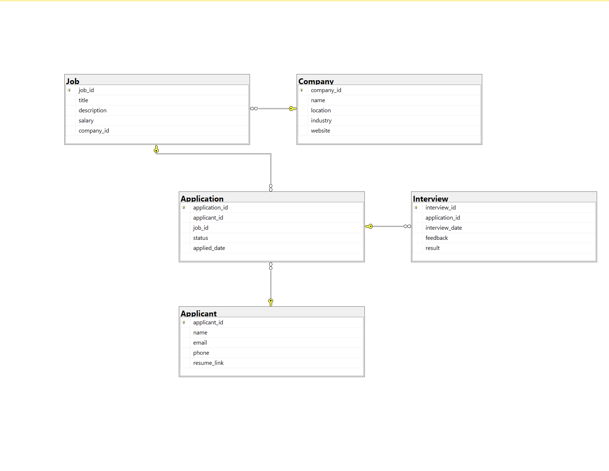

# Job Recruitment Database

## Overview

This project is a **Job Recruitment Database** designed using **Microsoft SQL Server**. It manages job postings, applications, interviews, and applicants efficiently. The database enables companies to post jobs, applicants to apply, and recruiters to track the recruitment process.

## Database Schema
The database consists of five main tables:

1. **Company** - Stores company details.
2. **Job** - Stores job postings.
3. **Applicant** - Stores applicant details.
4. **Application** - Tracks applications submitted by applicants.
5. **Interview** - Stores interview details and results.

### Entity-Relationship Diagram (ERD)
The ERD visualizes the relationships between entities in the database.

## Database Schema (DDL)
### Creating the Database
```sql
CREATE DATABASE JobRecruitmentDB;
GO
USE JobRecruitmentDB;
GO
```

### Creating Tables
```sql
CREATE TABLE Company (
    company_id INT PRIMARY KEY IDENTITY(1,1),
    name NVARCHAR(255) NOT NULL,
    location NVARCHAR(255),
    industry NVARCHAR(255),
    website NVARCHAR(255)
);

CREATE TABLE Job (
    job_id INT PRIMARY KEY IDENTITY(1,1),
    title NVARCHAR(255) NOT NULL,
    description TEXT,
    salary DECIMAL(10,2),
    company_id INT,
    FOREIGN KEY (company_id) REFERENCES Company(company_id) ON DELETE CASCADE
);

CREATE TABLE Applicant (
    applicant_id INT PRIMARY KEY IDENTITY(1,1),
    name NVARCHAR(255) NOT NULL,
    email NVARCHAR(255) UNIQUE NOT NULL,
    phone NVARCHAR(20),
    resume_link NVARCHAR(255)
);

CREATE TABLE Application (
    application_id INT PRIMARY KEY IDENTITY(1,1),
    applicant_id INT,
    job_id INT,
    status NVARCHAR(50) CHECK (status IN ('Pending', 'Interview', 'Hired', 'Rejected')),
    applied_date DATETIME DEFAULT GETDATE(),
    FOREIGN KEY (applicant_id) REFERENCES Applicant(applicant_id) ON DELETE CASCADE,
    FOREIGN KEY (job_id) REFERENCES Job(job_id) ON DELETE CASCADE
);

CREATE TABLE Interview (
    interview_id INT PRIMARY KEY IDENTITY(1,1),
    application_id INT,
    interview_date DATETIME NOT NULL,
    feedback TEXT,
    result NVARCHAR(50) CHECK (result IN ('Accepted', 'Rejected')),
    FOREIGN KEY (application_id) REFERENCES Application(application_id) ON DELETE CASCADE
);
```

## Sample Data
To populate the database with sample data:
```sql
INSERT INTO Company (name, location, industry, website) VALUES
('Microsoft', 'USA', 'Technology', 'https://www.microsoft.com'),
('Google', 'USA', 'Technology', 'https://www.google.com'),
('Amazon', 'USA', 'E-commerce', 'https://www.amazon.com');
```

## Queries
### Retrieve all jobs with company details
```sql
SELECT J.job_id, J.title, J.description, J.salary, C.name AS company_name, C.location
FROM Job J
JOIN Company C ON J.company_id = C.company_id;
```

### Retrieve applicants who applied for multiple jobs
```sql
SELECT A.name AS applicant_name, COUNT(App.application_id) AS total_applications
FROM Applicant A
JOIN Application App ON A.applicant_id = App.applicant_id
GROUP BY A.name
HAVING COUNT(App.application_id) > 1;
```

## How to Run
1. Install **Microsoft SQL Server** and **SSMS**.
2. Run the SQL scripts in `schema.sql` to create the database.
3. Run `data.sql` to insert sample data.
4. Execute queries in `queries.sql` to retrieve insights.

## Future Enhancements
- Add a user authentication system.
- Implement stored procedures for better data handling.
- Develop a web interface to interact with the database.

## Author
**Mahmoud Mousa** - Passionate Data Scientist

## License
This project is open-source under the **MIT License**.

